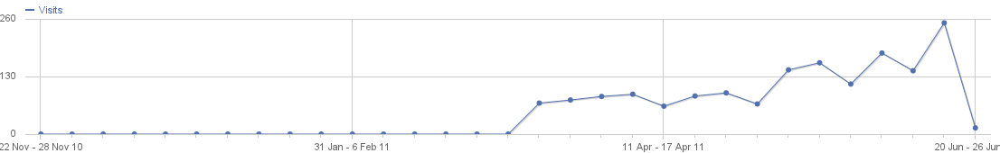

Thank you to everyone who is using or assisting with the GRASE Hotspot!

I thought I’d give you a bit of a heads up as to what has been happening over the last few months.

Firstly, a large number of new features have been added this year, including new report graphs, dynamic groups, and internationalisation. So far we have a French translation done, and an Italian and Portuguese translation are in progress. We have also had some members of the community discuss assisting with development which will speed new feature requests up!

For those who don’t know the history of the GRASE Hotspot, it started development almost 4 years ago, and has been in active use for the last 2 years in a single location. Last year a major change in it’s development occurred which was the ability to deploy it quickly and easily using debian packages. This was a major break through and removed a lot of the extra “installation” code that was being maintained just to keep it up to date. We also moved from a SVN repository to using BZR to maintain our source code repository. The big step was at the end of last year (2010) we finally released the project into the community on sourceforge, finally allowing the community to use it.

Since that release things have moved very fast with more development happening faster than before. Feature requests have been filled sometimes in less than a week since it was requested. The large community has also enabled us to find bugs better and squash them with more devices to test on. In particular this is helping fix the iOS bug that was preventing iPhone and iPad users from logging in. (Anyone still experiencing this bug, please contact us).

As you can see in this image, the traffic to the website has been on the increase which shows that we are getting more and more exposure! (The drop at the end is because it’s the start of a new week when I saved this graph).

To assist with the growth of the community, I’ve now setup a mailing list for users and developers to all participate in. This will enable any email support that is occurring to benefit the entire community, especially when the same problem is experienced by a few people. I’d ask that support requests are directed to the mailing list now instead of directly to me. [GRASE Hotspot Mailing list](/support/mailing-list)

For those who are wondering what is happening with the hotspot currently, here is what I am working on. Recurring limits, for example allowing a user to have 1hr per day. We are also hoping to have recurring data limits like 200Mb per day, however due to limitations in other software we rely on, it is not possible to guarantee exact limits, so the implementation will be to loosely enforce the data limits. I’m also going to start working on customisation of the login pages so that each location can display a more unique login page.

As I am a University student with a family to support, development will slow down over the next few weeks as I have Exams. (I have mostly finished the recurring time limit code, so that might be released during the exam period).

Lastly, I’d like to remind you that if this project has assisted you, to please consider donating ether some of your time or money to assist it’s development. Even if you aren’t a coder, working on better documentation, or doing translations are all ways you can assist. If you are a developer then working on new features. If you are just someone who benefits from it and don’t want to give time, your financial donations are always welcome as they allow me to develop while at University.

Thank you for being part of the GRASE Hotspot Community.

Tim