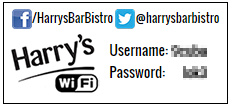

There is the ability to customise the printed tickets with CSS and HTML. The menu item is **Ticket Print Settings**.

An example customisation by a Bart



## Pre HTML
(The IP addresses/urls here should be replaced with ones that point to the correct locations)

```html
<div id="welcomemsg">/HarrysBarBistro @harrysbarbistro</div>
<div id="logo" style="height:60px;width:97px"></div>
```

## CSS
```css
@import url(http://fonts.googleapis.com/css?family=Roboto+Condensed);
@import url(http://fonts.googleapis.com/css?family=Oswald);

#logo {
    position: absolute;
    float: left;
    margin-top: -5px;
    height: 60px;
    width: 97px;
    margin-left: 6px;

}

#welcomemsg {
    font-family: 'Oswald', sans-serif;
    font-size: 12px;
    position: relative;
    text-align: center;
    font-weight: bold;
    padding-top: 6px;
    padding-bottom: 6px;
    font-weight: 300;
    vertical-align: top;
    -webkit-font-smoothing: antialiased;
}

#cutout_tickets {
    height: 100px;
}

body {
    line-height: 1.5;
    color: black;
    background-color: white;
    font-family: "Helvetica Neue", Arial, Helvetica, sans-serif;
    padding: 0;
    margin: 0;
}

.cutout_ticket {
    outline: solid 1px black;
    margin: 0.1cm;
    width: 5.9cm;
    height: 100px;
    float: left;
    text-align: right;
    font-size: 10pt;
    page-break-inside: avoid;
}

.ticket_item_label {
    float: left;
    position: relative;
    left: 100px;
    padding-right: 10px;
    padding-left: 5px;
    z-index: 100;
    display: inline-block;
    text-align: left;
    font-size: 14px;
    font-family: 'Oswald', sans-serif;
    -webkit-font-smoothing: antialiased;
}

.info_username, .info_password {
    font-weight: bold;
    text-align: left;
    padding-right: 20px;
    font-size: 15px;
    font-family: 'Roboto Condensed', sans-serif;
    -webkit-font-smoothing: antialiased;
}
```