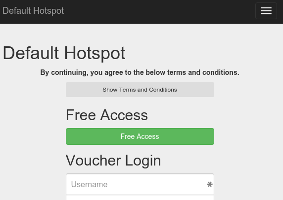

The newest builds support a "Free Login" button. This allows users to login without having an account manually created for them. To use this Free Login, follow these steps:

* Under **Groups** create a group just for the free login users. Apply any limits you want to the users, which would normally include a recurring daily limit of time or data. You may want to give them a hard time or data limit, if you just want to give them a free trial.
* **Portal Customisation** put the group name in the **Free Login Group** field. If you wish to customise the text of the button, for example "Accept TOS" then put that in the **Free Login Button Text** field

That's it, now your login page should include a Free Login button that gives automatic access like this "Free Access" button below!

