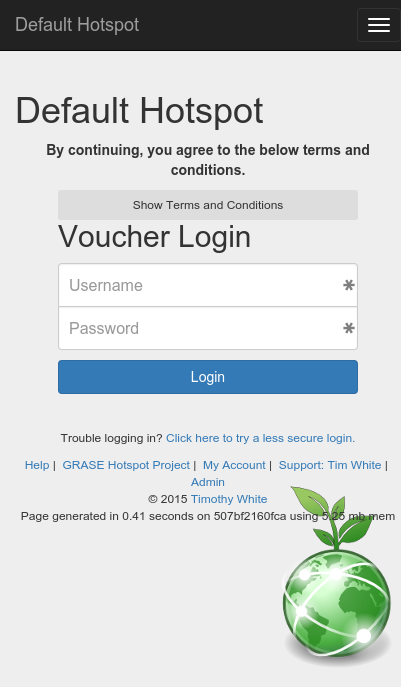
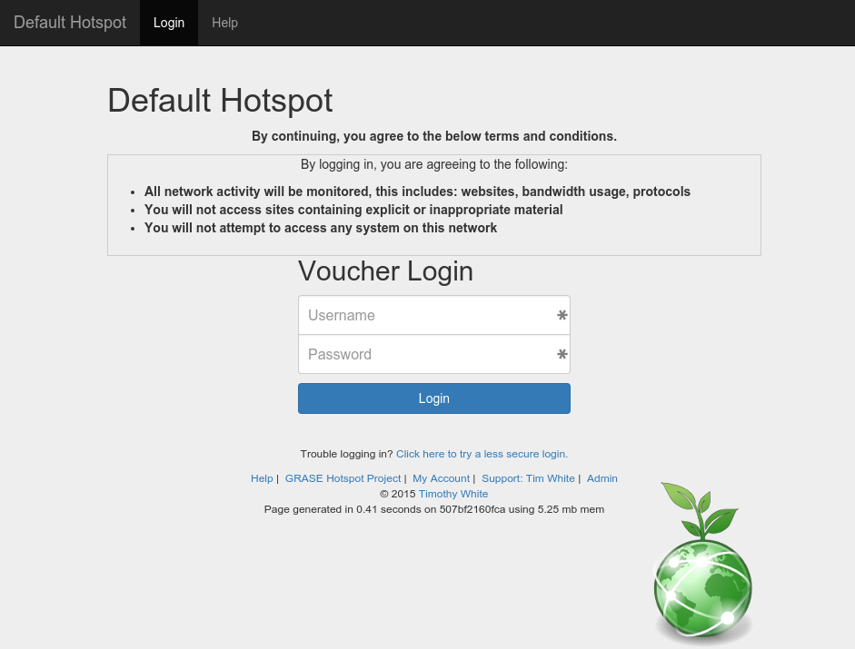
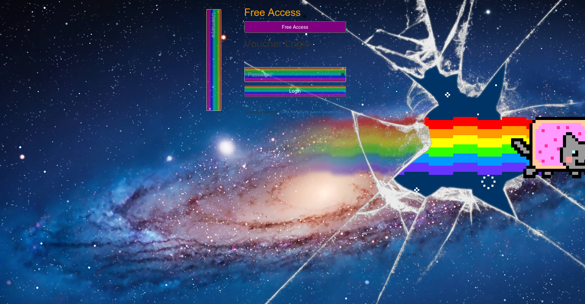

# Default Login Page

## Default Login page - Mobile Size


## Default Login page - Desktop Size


# Example Login Pages
Feel free to add examples of your login page

## Silly Nyan Cat Login Page
If you want to be really silly, anything is possible with HTML and CSS. With only a little bit of CSS, and by disabling some elements (no HTML modifications other than removing the TOS), you can have a funky Nyan cat login page that is includes a username field rotated 90 degrees!


``` css
.btn-success {
    background-color: purple;
}

.btn-primary, .form-control {
    background-color: white;
    background: -moz-linear-gradient(top,
    rgba(255, 0, 0, 0.5) 0%,
    rgba(255, 255, 0, 0.5) 15%,
    rgba(0, 255, 0, 0.5) 30%,
    rgba(0, 255, 255, 0.5) 50%,
    rgba(0, 0, 255, 0.5) 65%,
    rgba(255, 0, 255, 0.5) 80%,
    rgba(255, 0, 0, 0.5) 100%);
    background: -webkit-gradient(linear, left top, left bottom,
    color-stop(0%, rgba(255, 0, 0, 0.5)),
    color-stop(15%, rgba(255, 255, 0, 0.5)),
    color-stop(30%, rgba(0, 255, 0, 0.5)),
    color-stop(50%, rgba(0, 255, 255, 0.5)),
    color-stop(65%, rgba(0, 0, 255, 0.5)),
    color-stop(80%, rgba(255, 0, 255, 0.5)),
    color-stop(100%, rgba(255, 0, 0, 0.5)));
    color: white;
}

#tosaccept h2 {
    color: orange;
}

body {
    background-image: url('http://cdn01.wallconvert.com/_media/conv/1/14/139443-nyan-cat.jpg')
}

#username {
    -webkit-transform: rotate(90deg);
    -moz-transform: rotate(90deg);
    -o-transform: rotate(90deg);
    -ms-transform: rotate(90deg);
    transform: rotate(90deg);
    right: 80%;
}
```